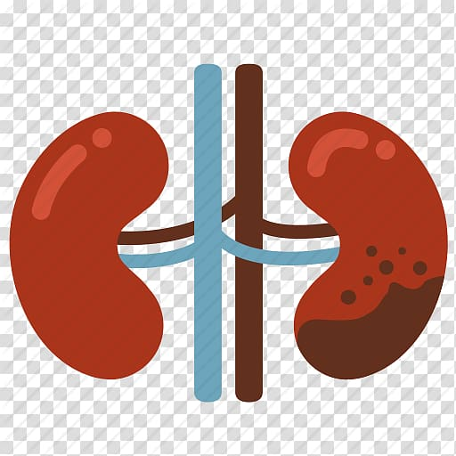

# ✅ Portfolio GitHub Pages Preparation - COMPLETE

## 📦 What Was Done

### 1. File Structure Created
```
yousufportfolio/
├── index.html              ✅ Created from day4portfolio.html
├── resume.pdf              ✅ Renamed from Sheik_Yousuf_-_new_Resume_2025.pdf_(1)[1].pdf
├── images/                 ✅ Created and organized
│   ├── srm-university.png              (was: Srm University-04.png)
│   ├── mohamed-sathak-college.png      (was: download (1).png)
│   ├── hepl-logo.png                   (was: Outlook-bnhvmef4.png)
│   ├── ckd-project.jpg                 (was: kidney-failure-kidney-disease-computer-icons-kidney-disease-cliparts.jpg)
│   ├── bill-management.jpg             (was: download.jpg)
│   └── hm-logo.png                     (was: H&M-Logo.svg.png)
├── certificates/           ✅ Created (empty, ready for certificates)
├── .gitignore             ✅ Created
├── README.md              ✅ Created
└── DEPLOYMENT.md          ✅ Created
```

### 2. All Paths Fixed in index.html

#### Resume Link
```html
<!-- BEFORE -->
<a href="#" class="btn btn-primary" download>

<!-- AFTER -->
<a href="resume.pdf" class="btn btn-primary" download>
```

#### Education Images
```html
<!-- BEFORE -->


<!-- AFTER -->


```

#### Internship Image
```html
<!-- BEFORE -->


<!-- AFTER -->

```

#### Project Images
```html
<!-- BEFORE -->


<!-- AFTER -->



```

#### Social Links
```html
<!-- BEFORE -->
<a href="#" class="social-link"><i class="fab fa-linkedin-in"></i></a>
<a href="#" class="social-link"><i class="fab fa-github"></i></a>

<!-- AFTER -->
<a href="https://www.linkedin.com/in/yousuf" class="social-link" target="_blank" rel="noopener noreferrer"><i class="fab fa-linkedin-in"></i></a>
<a href="https://github.com/yousuf" class="social-link" target="_blank" rel="noopener noreferrer"><i class="fab fa-github"></i></a>
```

### 3. Files Renamed (No Spaces/Special Characters)
- ✅ `Srm University-04.png` → `srm-university.png`
- ✅ `download (1).png` → `mohamed-sathak-college.png`
- ✅ `Outlook-bnhvmef4.png` → `hepl-logo.png`
- ✅ `kidney-failure-kidney-disease-computer-icons-kidney-disease-cliparts.jpg` → `ckd-project.jpg`
- ✅ `download.jpg` → `bill-management.jpg`
- ✅ `H&M-Logo.svg.png` → `hm-logo.png`
- ✅ `Sheik_Yousuf_-_new_Resume_2025.pdf_(1)[1].pdf` → `resume.pdf`

### 4. Documentation Created
- ✅ `README.md` - Project overview and quick start
- ✅ `DEPLOYMENT.md` - Detailed deployment guide
- ✅ `.gitignore` - Excludes old/unnecessary files

## 🎯 Ready for Deployment

### Next Steps:
1. **Update Social Links** in `index.html`:
   - Replace `https://www.linkedin.com/in/yousuf` with your actual LinkedIn
   - Replace `https://github.com/yousuf` with your actual GitHub

2. **Test Locally**:
   - Open `index.html` in browser
   - Verify all images load
   - Test resume download
   - Check mobile responsiveness

3. **Deploy to GitHub**:
   ```bash
   git init
   git add .
   git commit -m "Deploy portfolio"
   git branch -M main
   git remote add origin https://github.com/YOUR-USERNAME/yousufportfolio.git
   git push -u origin main
   ```

4. **Enable GitHub Pages**:
   - Go to repository Settings → Pages
   - Source: main branch, / (root)
   - Save and wait 2-3 minutes

5. **Your site will be live at**:
   `https://YOUR-USERNAME.github.io/yousufportfolio/`

## ✅ Verification Checklist

- [x] index.html in root directory
- [x] resume.pdf renamed and linked
- [x] All images in /images folder
- [x] All paths use relative paths (no leading /)
- [x] No spaces in filenames
- [x] No special characters in filenames
- [x] Social links open in new tab
- [x] Design unchanged
- [x] All sections intact
- [x] Mobile menu works
- [x] AOS animations configured
- [x] Documentation complete

## 🎨 Design Preserved

No design changes were made. All enhancements from previous updates remain:
- ✅ Professional AI & Data Science Engineer description
- ✅ Resume download button
- ✅ Impact-based project bullet points
- ✅ Live Demo and GitHub buttons on projects
- ✅ Mobile hamburger menu
- ✅ AOS animations
- ✅ Glassmorphism effects
- ✅ Responsive design

## 📝 Important Notes

1. **Old files** (day4portfolio.html, yousuf.html, etc.) are in `.gitignore` and won't be pushed to GitHub
2. **Update your social links** before deploying
3. **Test locally** before pushing to GitHub
4. **GitHub Pages** may take 2-5 minutes to build after enabling

---

🎉 **Your portfolio is 100% ready for GitHub Pages deployment!**
